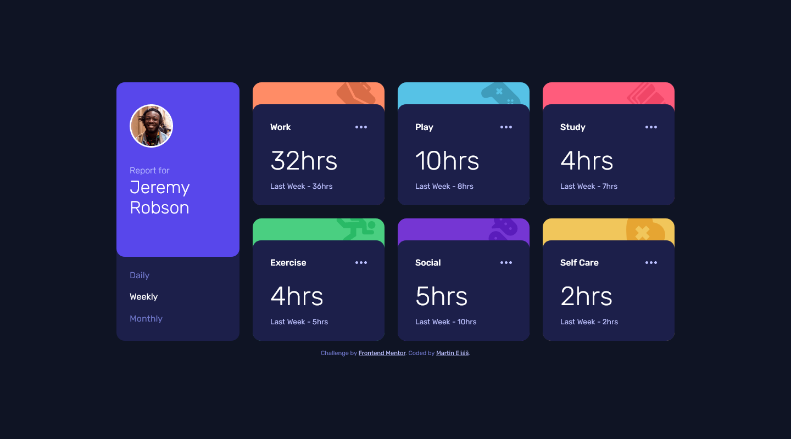

# Frontend Mentor - Time tracking dashboard solution

This is a solution to the [Time tracking dashboard challenge on Frontend Mentor](https://www.frontendmentor.io/challenges/time-tracking-dashboard-UIQ7167Jw). Frontend Mentor challenges help you improve your coding skills by building realistic projects.

## Table of contents

- [Overview](#overview)
  - [The challenge](#the-challenge)
  - [Screenshot](#screenshot)
  - [Links](#links)
- [My process](#my-process)
  - [Built with](#built-with)
  - [What I learned](#what-i-learned)
  - [Continued development](#continued-development)
  - [Useful resources](#useful-resources)
- [Author](#author)

## Overview

### The challenge

Users should be able to:

- View the optimal layout for the site depending on their device's screen size
- See hover states for all interactive elements on the page
- Switch between viewing Daily, Weekly, and Monthly stats

### Screenshot

### Links

- Solution URL: [https://www.frontendmentor.io/solutions/dailyweeklymonthly-time-tracking-dashboard-BJvO9aI85](https://www.frontendmentor.io/solutions/dailyweeklymonthly-time-tracking-dashboard-BJvO9aI85)
- Live Site URL: [https://time-tracking-dashboard-ts.vercel.app/](https://time-tracking-dashboard-ts.vercel.app/)

## My process

### Built with

- Semantic HTML5 markup
- CSS custom properties
- Flexbox
- CSS Grid
- Mobile-first workflow
- Typescript
- [React](https://reactjs.org/) - JS library
- [Sass/Scss](https://sass-lang.com/) - For styles

### What I learned

This was one of my longest challenges, i tried to do it all on my own. Mostly i struggled on sending props from one component to other. But anyways, i learned to fetch data, from local json in this case, communicate through components, little bit of typescript...

### Continued development

I´ll definitely continue to practice React to get better and to create apps with more ease.

### Useful resources

- [Example resource 1](https://reactjs.org/docs/create-a-new-react-app.html#create-react-app) - This helped me to start React with node.

## Author

- LinkedIn - [Martin Eliáš](https://www.linkedin.com/in/martin-eli%C3%A1%C5%A1-455550209/)
- Frontend Mentor - [@martinelias1312](https://www.frontendmentor.io/profile/martinelias1312)
